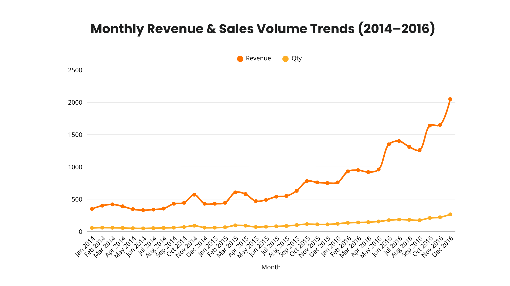
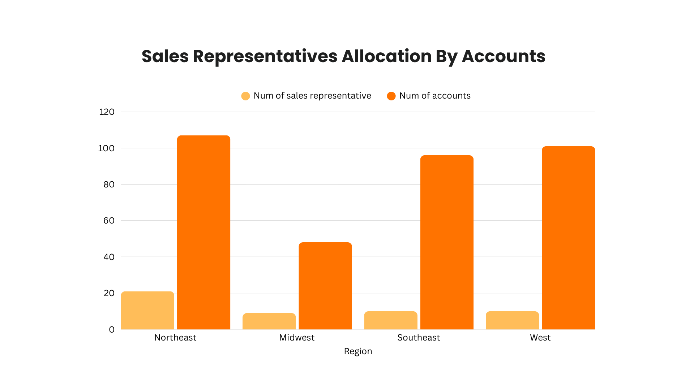
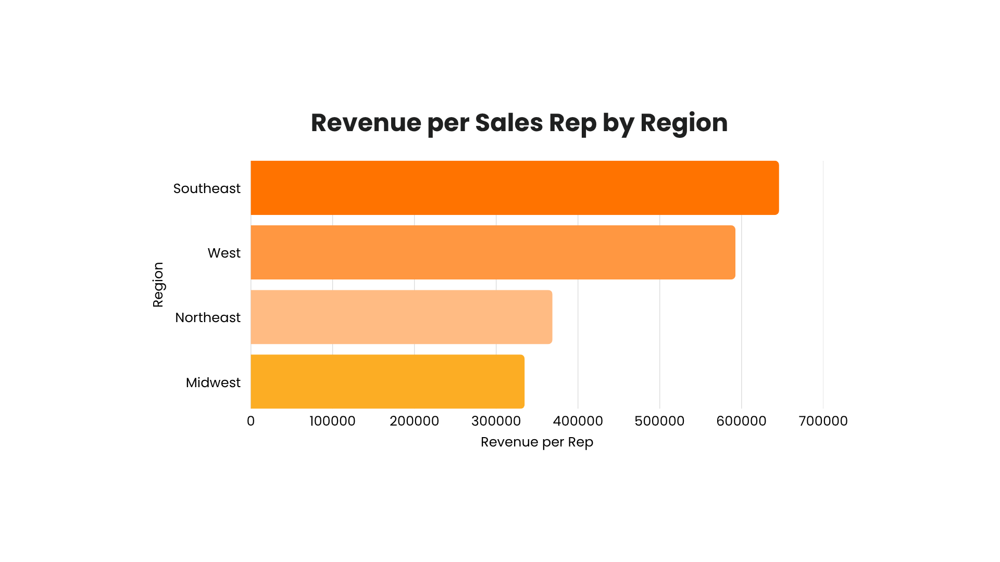

# $23M in Revenue — But Should We Acquire?
**B2B Acquisition Analysis · SQL · Business Intelligence**

## Overview
Analyzed a $23.1M B2B sales database across 352 accounts to evaluate acquisition viability, identify operational inefficiencies, and surface revenue growth patterns for Parch & Posey, a B2B paper company.

> Full write-up coming soon.

## Methods
- Multi-table SQL joins across 5 relational tables
- Aggregations, subqueries, and UNION operations
- Revenue and regional performance analysis
- Customer segmentation by industry

## Key Findings
- **Revenue grew 216%** from 2014–2016 but did not reflect operational readiness
- **Sales rep allocation was misaligned** — Northeast held 21 of 51 reps but generated only $368K revenue per rep vs $645K in the Southeast
- **Finance & Insurance and Energy** were the highest-ordering customer segments (471 and 417 orders respectively)
- **Recommendation: Do not proceed** — operational inefficiencies, resource misallocation, and data gaps outweighed the growth story

## Tech Stack
SQL · DBeaver · PostgreSQL

## Files
- `analysis_queries.sql` — all SQL queries used for analysis

## Key Visual Insights

### Monthly Revenue & Sales Volume Trends (2014–2016)

Revenue grew steadily from 2014 before accelerating sharply in mid-2016, reaching ~$2M by December 2016. Sales volume followed a similar but flatter trajectory, suggesting average order value increased over time.

### Sales Representatives Allocation By Accounts

Northeast holds the most accounts (107) but also the most reps (21), while Southeast and West manage comparable account loads with half the headcount.

### Revenue per Sales Rep by Region

Southeast and West reps generate nearly 2x the revenue per person compared to Northeast ($645K and $593K vs. $369K), indicating the Northeast is overstaffed relative to its revenue output.

## How to Run
Run queries in DBeaver or PostgreSQL using the relevant database tables.
